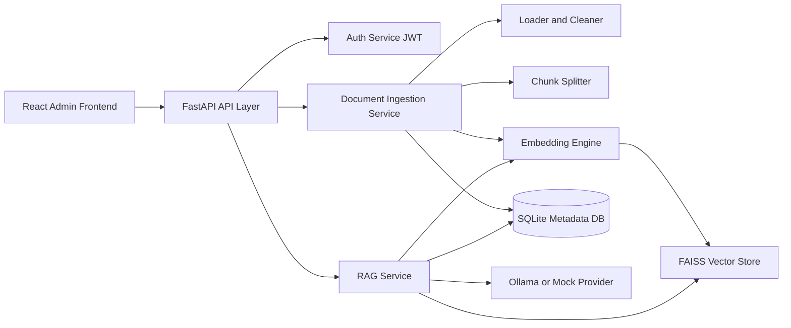
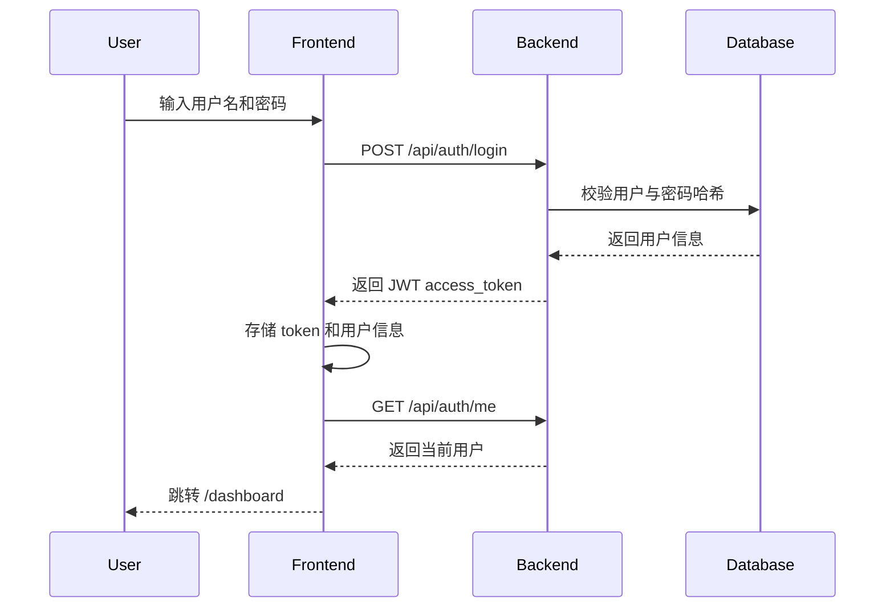
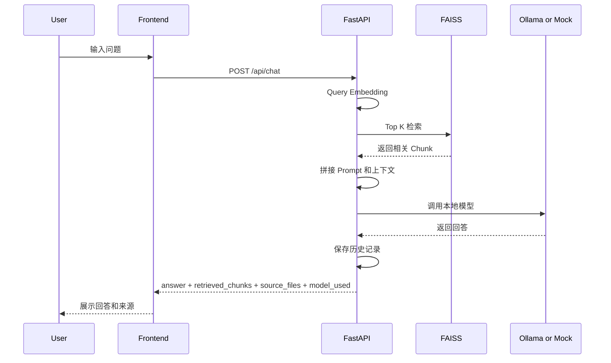

# 企业内部知识与文档 RAG Copilot 系统

## 项目简介
这是一个面向企业内部研发协作、知识沉淀和代码理解场景的本地化 RAG Copilot 后台系统。项目提供文档接入、知识切片、Embedding、FAISS 向量检索、本地模型问答、后台管理、登录认证与基础运维配置能力，适合用于企业私有知识库和研发支持平台的原型建设与作品展示。

## 技术栈
- 后端：Python 3.11、FastAPI、SQLAlchemy、JWT、FAISS、Ollama、Docker
- 前端：React、TypeScript、Vite、React Router、Axios、Ant Design
- 存储：SQLite（默认，可扩展 PostgreSQL）、本地文件目录、FAISS 索引文件
- 部署：Docker、Docker Compose

## 系统架构


### 架构说明
- 前端负责后台页面、登录态校验、文档管理、问答交互与系统配置。
- 后端统一提供认证、文档接入、索引构建、问答、历史记录、控制台摘要与系统设置接口。
- 文档进入系统后先做清洗和切块，再生成 Embedding 并写入 FAISS。
- 元数据与历史记录保存在数据库中，原始文档和索引文件保存在本地目录。
- 本地模型优先通过 Ollama 调用；如果本地模型不可用，系统自动回退到 `mock` 模式，保证演示链路可用。

## 页面模块说明
- 登录页：管理员用户名密码登录，成功后进入控制台。
- 控制台首页：展示文档总数、已索引文档数、最近问答次数、当前可用模型、系统状态。
- 文档管理：支持查看文档列表、上传文档、重建索引、删除文档。
- 智能问答：支持输入问题、选择 Provider、展示回答、召回片段、来源文件和当前模型。
- 历史记录：展示提问、回答摘要、模型、时间和来源文件。
- 系统设置：支持查看和保存默认 Provider、默认 top_k、数据目录、索引目录。

## 登录认证流程


### 登录认证流程说明
1. 前端调用 `POST /api/auth/login` 提交用户名和密码。
2. 后端查询管理员用户，使用安全哈希校验密码。
3. 校验通过后签发 JWT。
4. 前端保存 token，并在后续请求中通过 `Authorization: Bearer <token>` 携带。
5. 未登录访问后台路由时，前端自动跳转到 `/login`。

## 文档接入流程
1. 管理员上传 `README.md`、`Markdown`、`txt`、`json` 等文本型资料，或将资料放入 `backend/data/`。
2. 后端 Loader 扫描文件，做文本清洗和结构整理。
3. Splitter 按 chunk 规则切分文档。
4. 为每个 chunk 生成元数据：
   - 文件名
   - 文件路径
   - 文件类型
   - chunk_id
5. Embedding 模块生成向量。
6. FAISS 构建或重建索引。
7. 数据库记录文档元数据、chunk 关系、历史问答和系统配置。

## RAG 工作流说明


### RAG 工作流说明
1. 用户输入问题并选择 Provider。
2. 后端对 query 做 Embedding。
3. 使用 FAISS 检索最相关的 `top_k` 文档块。
4. 将检索片段拼接进受约束 Prompt。
5. 调用 Ollama 模型生成回答。
6. 如果 Ollama 不可用，则自动切换到 `mock` 模式。
7. 返回最终回答、召回片段、来源文件和模型信息，并记录历史问答。

## 本地启动方式

### 1. 启动后端
```powershell
cd backend
python -m venv .venv
.\.venv\Scripts\Activate.ps1
pip install -r requirements.txt
Copy-Item .env.example .env
uvicorn app.main:app --reload --host 0.0.0.0 --port 8000
```

### 2. 启动前端
```powershell
cd frontend
npm install
npm run dev
```

如果 Windows 环境对中文路径敏感，可以临时使用映射盘符：

```powershell
subst X: "d:\codex\本地大模型驱动的企业代码与文档 RAG Copilot"
cd /d X:\frontend
npm install
npm run dev
```

### 3. 默认登录账号
- 用户名：`admin`
- 密码：使用你在 `.env` 中配置的 `RAG_COPILOT_INITIAL_ADMIN_PASSWORD`

## Docker 启动方式

### 1. 准备环境变量
```powershell
Copy-Item .env.example .env
```

### 2. 仅启动前后端，使用 mock 演示
```bash
docker compose up --build
```

启动后访问：
- 前端：`http://localhost:5173`
- 后端：`http://localhost:8000/docs`

### 3. 启动前后端 + Ollama
```bash
docker compose --profile llm up --build -d
```

如果需要拉取模型：
```bash
docker exec -it rag-copilot-ollama ollama pull qwen2.5:7b
docker exec -it rag-copilot-ollama ollama pull deepseek-r1:7b
docker exec -it rag-copilot-ollama ollama pull llama3.1:8b
```

## 没有本地模型时如何使用 mock 模式演示
如果机器上没有安装 Ollama，或者没有下载任何模型，也可以完整演示系统：

1. 正常启动前后端。
2. 上传文档并构建索引。
3. 在智能问答页选择 `mock` 作为 Provider。
4. 提问后系统仍会执行：
   - query embedding
   - FAISS 检索
   - 上下文拼接
   - 返回基于检索结果的保守回答

这意味着即使没有本地模型，也能完整展示“知识接入 + 向量索引 + 检索增强 + 问答返回”的业务闭环。

## 项目亮点
- 实现了企业知识库从文档接入、文本清洗、切块、Embedding、FAISS 检索到问答返回的完整闭环。
- 支持本地模型与 `mock` 双模式，既满足真实本地化部署，也能在无模型环境下稳定演示。
- 搭建了完整的后台管理系统，包含认证、控制台、文档管理、问答、历史记录、系统设置等模块。

## 简历可写点
- 设计并实现企业内部知识与文档 RAG Copilot 系统，完成从文档接入、Embedding、FAISS 检索到本地模型问答的全链路开发。
- 基于 FastAPI + React + Ant Design 搭建前后端分离后台平台，支持 JWT 登录认证、文档索引管理、问答历史记录与系统配置。
- 设计 Ollama / Mock 双 Provider 策略，在无本地模型环境下仍可稳定演示检索增强问答能力，提升系统可交付性和展示完整度。

## 适合写进简历的 3 条项目亮点
1. 从 0 到 1 搭建企业内部知识与文档 RAG Copilot，覆盖文档接入、向量索引、本地模型问答和后台系统管理。
2. 设计基于 FAISS 的本地检索增强问答架构，并实现 Ollama 不可用时自动回退 `mock` 的鲁棒性方案。
3. 落地 React + Ant Design 企业后台界面，打通登录认证、文档管理、索引构建、问答展示、历史记录与系统设置全流程。

## 项目目录概览
```text
.
├─ backend/
│  ├─ app/
│  ├─ data/
│  ├─ Dockerfile
│  └─ requirements.txt
├─ frontend/
│  ├─ src/
│  ├─ Dockerfile
│  └─ package.json
├─ docker-compose.yml
├─ .env.example
└─ README.md
```

## 当前版本说明
- 当前系统设置页会将默认 Provider、默认 top_k、数据目录、索引目录保存到后端数据库，适合作为后台配置中心原型。
- 当前索引与数据目录的运行时主配置仍以环境变量为准，后续可继续扩展为“保存后即时生效”的热更新机制。
