# Enterprise RAG Copilot

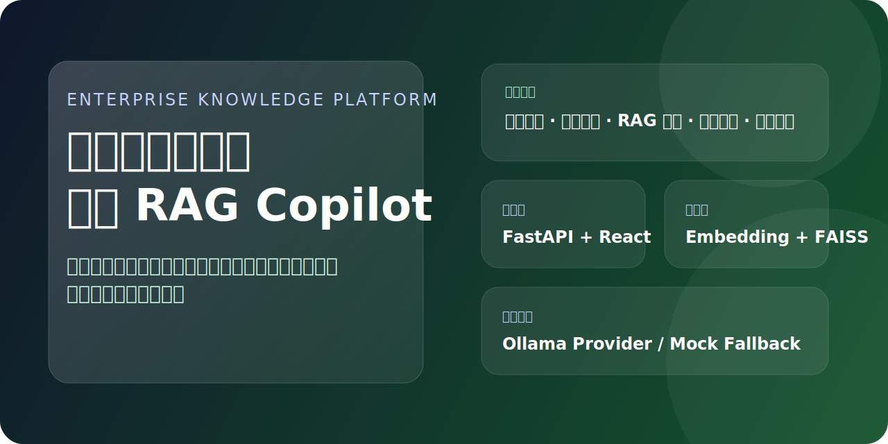

[](https://www.python.org/)
[](https://fastapi.tiangolo.com/)
[](https://react.dev/)
[](https://vitejs.dev/)
[](https://ant.design/)
[](https://github.com/facebookresearch/faiss)
[](https://ollama.com/)
[](#)

企业内部知识与文档 RAG Copilot 是一个面向研发协作、知识沉淀和代码理解场景的本地化后台系统。项目打通了文档接入、文本清洗、切片、Embedding、FAISS 检索、RAG 问答、本地模型接入和后台管理界面，适合做企业知识库原型、私有化 RAG 演示项目和简历作品。

## 项目亮点

- 前后端分离落地完整闭环：从登录认证、文档管理、索引构建，到智能问答、历史记录、系统设置全部可运行。
- 支持本地模型与降级方案：可接入 Ollama 的 `qwen`、`deepseek`、`llama`，本地模型不可用时自动回退 `mock`，保证演示不断链。
- 支持企业资料接入：可扫描本地 `README.md`、Markdown、TXT、JSON，也支持从中国站点抓取资料并自动入库。

## 项目预览

### 登录页

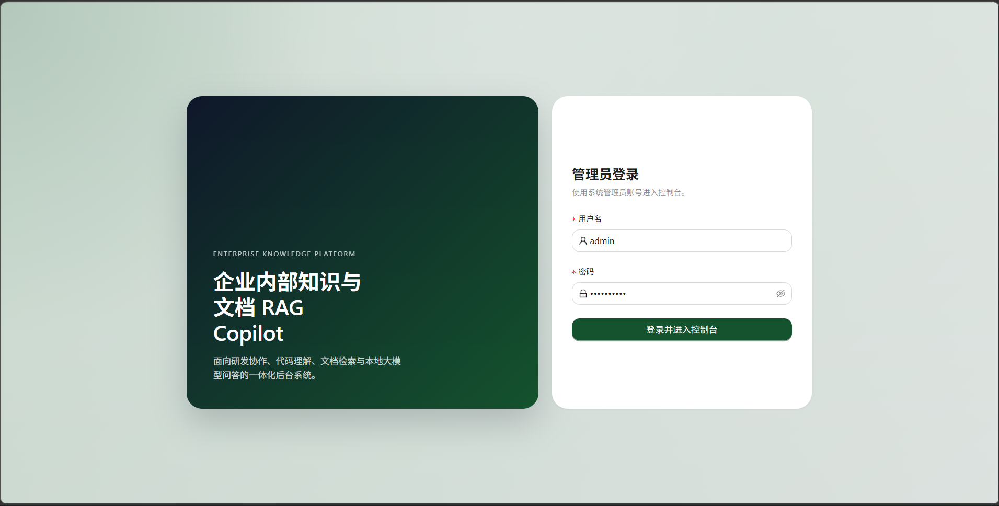

### 控制台首页

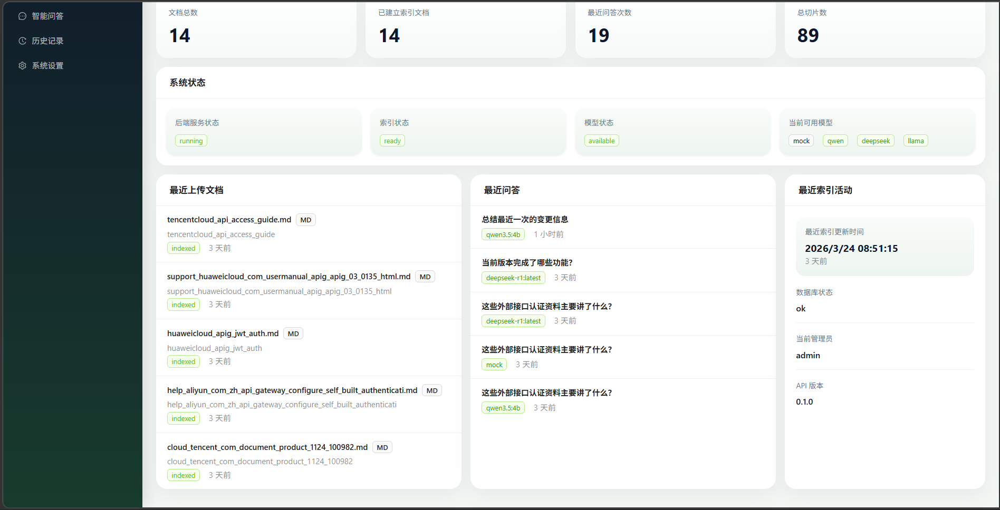

### 文档管理

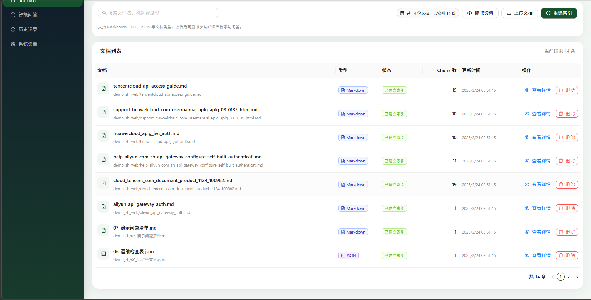

### 智能问答

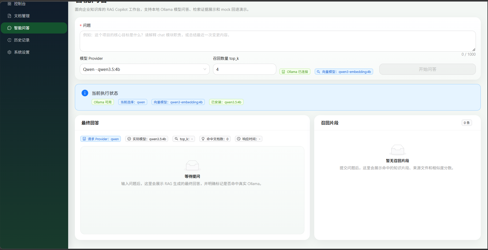

### 历史记录
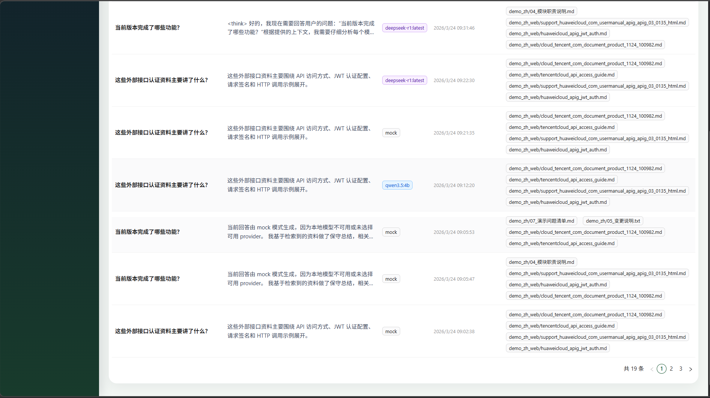

### 系统设置
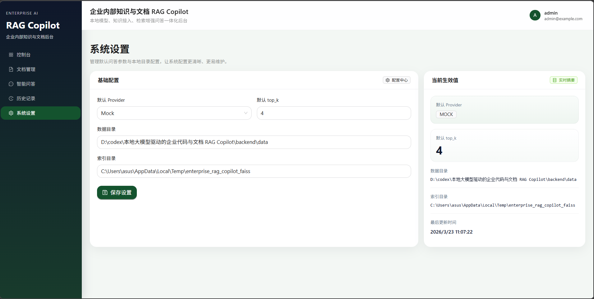

## 在线演示说明

当前仓库暂未提供公开在线地址，主要原因是项目依赖本地文件目录、FAISS 索引和本地模型环境，更适合作为可本地跑通的企业知识库原型来展示。

如果你想快速演示，可以直接使用下面两种方式：

- 本地演示：按 README 中的“本地启动方式”启动前后端，使用示例资料和 `mock` 模式即可完整体验。
- Docker 演示：执行 `docker compose up --build`，无需本地模型也能跑通上传、建索引和问答流程。

### 推荐演示账号

- 用户名：`admin`
- 密码：使用你在 `.env` 中配置的 `RAG_COPILOT_INITIAL_ADMIN_PASSWORD`

### 推荐演示模式

- 没有本地模型时：在智能问答页选择 `mock`
- 已安装 Ollama 时：可切换 `qwen`、`deepseek` 或 `llama`

## 技术栈

### 后端

- Python 3.11+
- FastAPI
- SQLAlchemy
- JWT 认证
- Ollama
- FAISS
- Docker

### 前端

- React
- TypeScript
- Vite
- React Router
- Axios
- Ant Design

### 存储与运行

- SQLite
- 本地文件目录
- FAISS 本地索引
- Docker Compose

## 系统架构

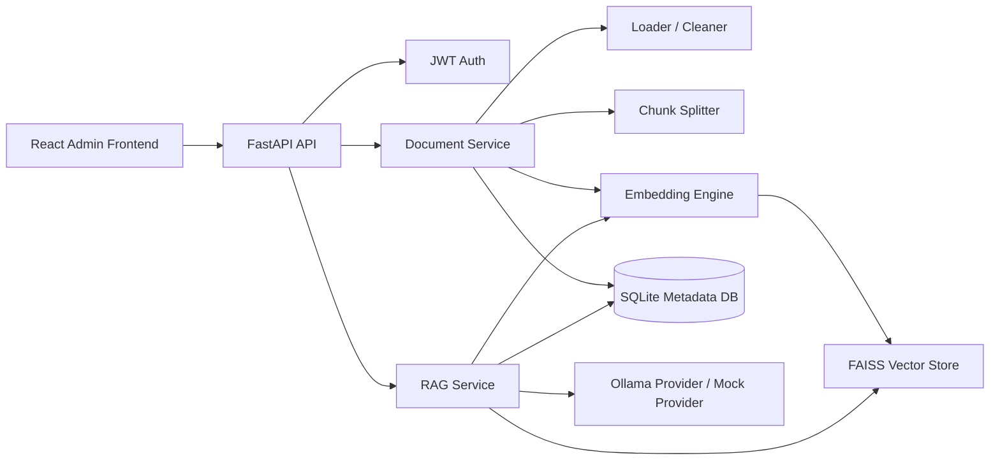

### 架构说明

- 前端负责后台页面、登录态校验、文档上传、问答交互和系统设置展示。
- 后端统一提供认证、文档接入、索引构建、问答、历史记录和摘要统计接口。
- 文档进入系统后先做清洗和切分，再做 Embedding 和 FAISS 建索引。
- 元数据和历史记录保存在数据库，原始资料与索引文件保存在本地目录。
- 大模型优先通过 Ollama 调用，本地模型不可用时自动降级到 `mock`。

## 页面模块

- `登录页`：管理员用户名密码登录，登录成功后进入控制台。
- `控制台首页`：展示文档总数、索引状态、最近问答、系统状态和最近活动。
- `文档管理`：支持上传、搜索、删除、重建索引、一键抓取中国站点资料并自动入库。
- `智能问答`：支持输入问题、选择 Provider、设置 `top_k`、查看最终回答和召回片段。
- `历史记录`：查看提问、回答摘要、模型、来源文件和时间。
- `系统设置`：配置默认 Provider、默认 `top_k`、数据目录和索引目录。

## 登录认证流程

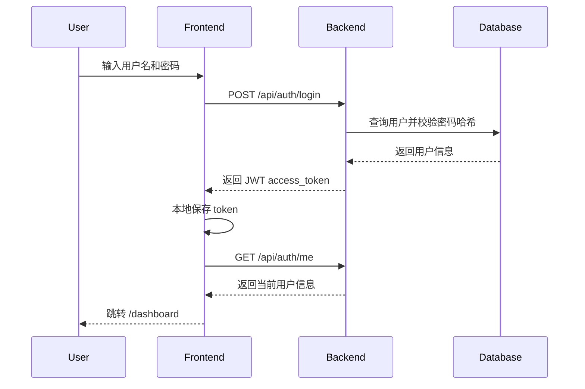

### 认证说明

1. 前端调用 `POST /api/auth/login` 提交用户名和密码。
2. 后端查询管理员账号并使用密码哈希校验。
3. 校验成功后签发 JWT。
4. 前端保存 token，并在后续请求中通过 `Authorization: Bearer <token>` 携带。
5. 未登录访问后台路由时，前端自动跳转 `/login`。

## 文档接入流程

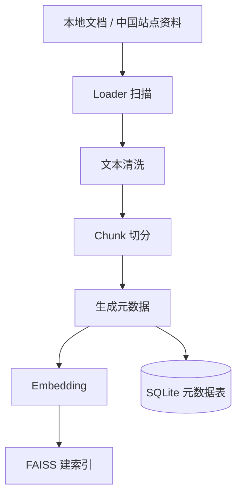

### 当前支持的知识源

- `README.md`
- Markdown 文档
- TXT 文本
- 简单 JSON 文档
- 接口说明文本
- 变更说明文本
- 中国站点网页资料抓取内容

## RAG 工作流

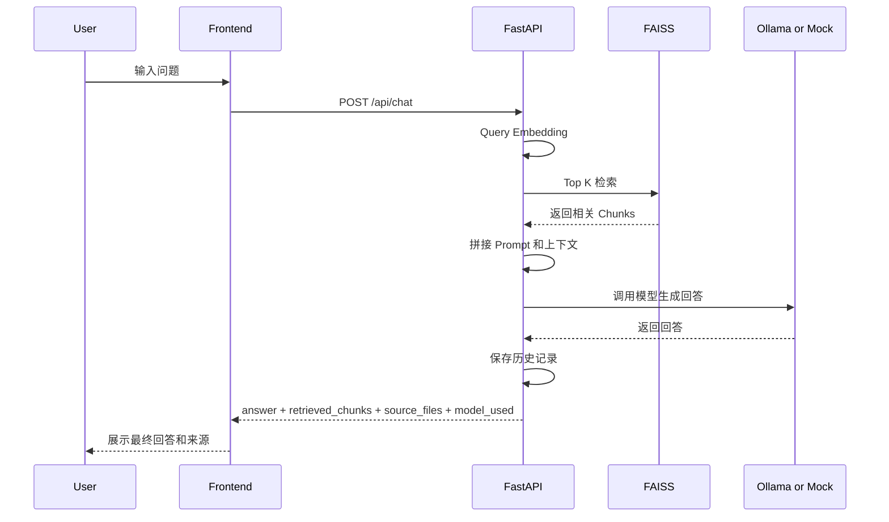

### 工作流说明

1. 用户输入问题并选择 Provider。
2. 后端对 query 做 Embedding。
3. 使用 FAISS 检索最相关的 `top_k` 文档块。
4. 将召回片段拼接为受约束的 RAG Prompt。
5. 调用 Ollama 或 Mock Provider 生成回答。
6. 返回最终回答、召回片段、来源文件和模型信息。
7. 保存本次问答历史，供控制台和历史页展示。

## 核心接口

### 认证

- `POST /api/auth/login`
- `GET /api/auth/me`

### 文档与索引

- `GET /api/documents`
- `POST /api/documents/upload`
- `POST /api/documents/reindex`
- `DELETE /api/documents/{id}`
- `GET /api/index/status`

### 问答与历史

- `POST /api/chat`
- `GET /api/history`

### 控制台与设置

- `GET /api/dashboard/summary`
- `GET /api/settings`
- `POST /api/settings`

## 本地启动方式

### 1. 启动后端

```powershell
cd backend
python -m venv .venv
.\\.venv\\Scripts\\python.exe -m pip install -r requirements.txt
Copy-Item .env.example .env
.\\scripts\\start_backend.ps1
```

### 2. 启动前端

```powershell
cd frontend
npm install
npm run dev
```

### 3. 默认登录账号

- 用户名：`admin`
- 密码：使用你在 `.env` 中配置的 `RAG_COPILOT_INITIAL_ADMIN_PASSWORD`

### 4. 演示建议顺序

1. 登录后台。
2. 进入文档管理页，点击“重新构建索引”。
3. 或者点击“一键抓取中国站点资料并入库”。
4. 进入智能问答页，先使用 `mock` 做演示。
5. 在历史记录页查看刚才的问答结果。

## Docker 启动方式

### 1. 准备环境变量

```powershell
Copy-Item .env.example .env
```

### 2. 使用 Mock 模式启动

```bash
docker compose up --build
```

启动后访问：

- 前端：`http://localhost:5173`
- 后端文档：`http://localhost:8000/docs`

### 3. 启动前后端 + Ollama

```bash
docker compose --profile llm up --build -d
```

如需拉取模型：

```bash
docker exec -it rag-copilot-ollama ollama pull qwen2.5:7b
docker exec -it rag-copilot-ollama ollama pull deepseek-r1:7b
docker exec -it rag-copilot-ollama ollama pull llama3.1:8b
```

## 没有本地模型时如何演示

如果机器上没有安装 Ollama，或者没有下载任何模型，也可以完整演示：

1. 正常启动前后端。
2. 上传文档或重建索引。
3. 在智能问答页选择 `mock` 作为 Provider。
4. 系统仍会执行：
   - query embedding
   - FAISS 检索
   - 上下文拼接
   - 返回基于召回结果的保守回答

这意味着即使没有本地模型，也能完整展示“知识接入 + 向量索引 + 检索增强 + 问答返回”的业务闭环。

## 项目目录概览

```text
.
├── backend/
│   ├── app/
│   ├── data/
│   ├── scripts/
│   ├── Dockerfile
│   └── requirements.txt
├── docs/
│   └── images/
├── frontend/
│   ├── src/
│   ├── Dockerfile
│   └── package.json
├── docker-compose.yml
├── .env.example
└── README.md
```

## 适合写进简历的 3 条亮点

1. 从 0 到 1 设计并实现企业内部知识与文档 RAG Copilot，打通文档接入、向量索引、本地模型问答和后台管理全链路。
2. 基于 FastAPI + React + Ant Design 落地前后端分离管理系统，支持 JWT 认证、文档管理、RAG 问答、历史记录和系统设置。
3. 设计 Ollama / Mock 双 Provider 机制，在无本地模型环境下仍可完整演示检索增强问答流程，提升系统可交付性和展示稳定性。

## 当前说明

- 当前项目默认保留了演示用中文资料和中国站点抓取资料，便于直接跑通索引和问答。
- `.env`、数据库、向量索引、上传文件、`node_modules` 和构建产物不会上传到 GitHub。
- 如果你要把它继续扩展成正式项目，可以优先补全文档权限、多知识库隔离、异步任务队列和生产级存储方案。
